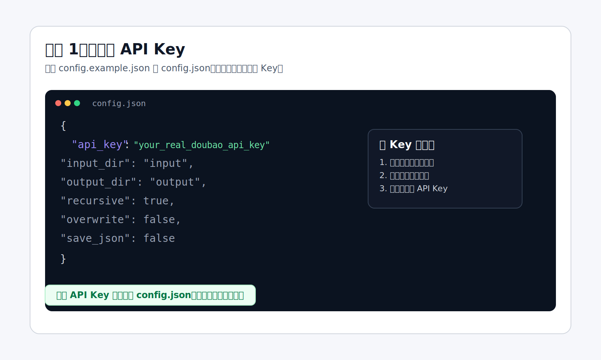
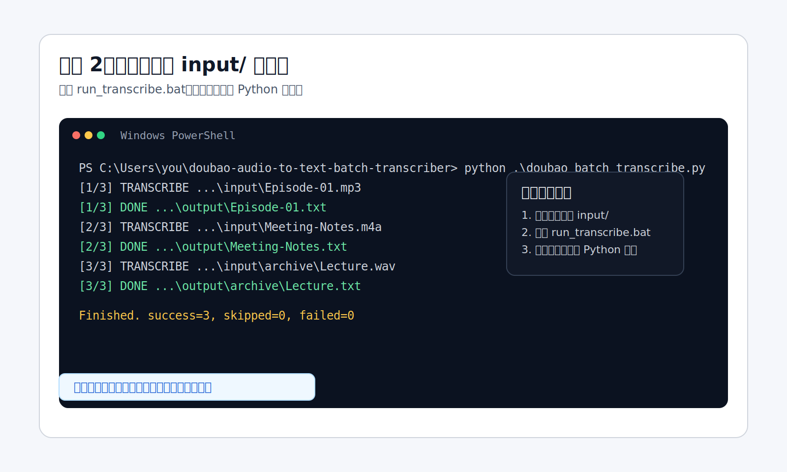
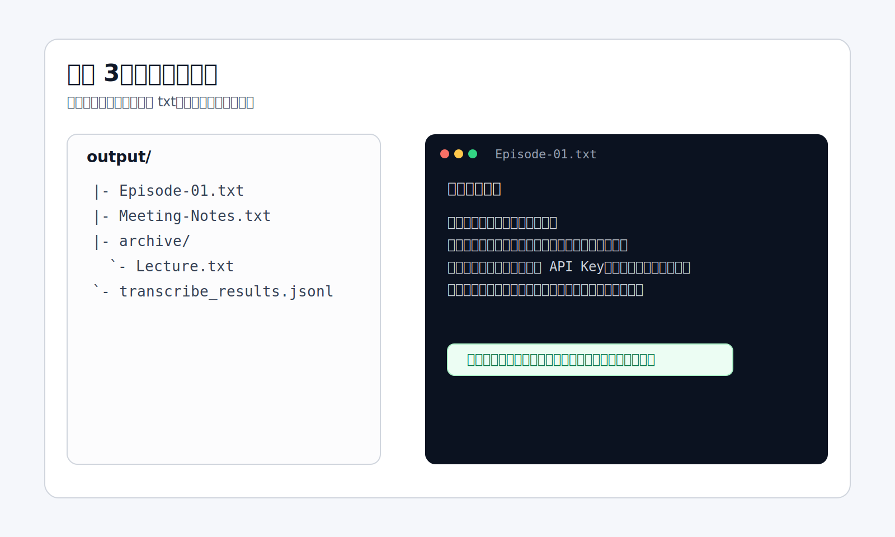
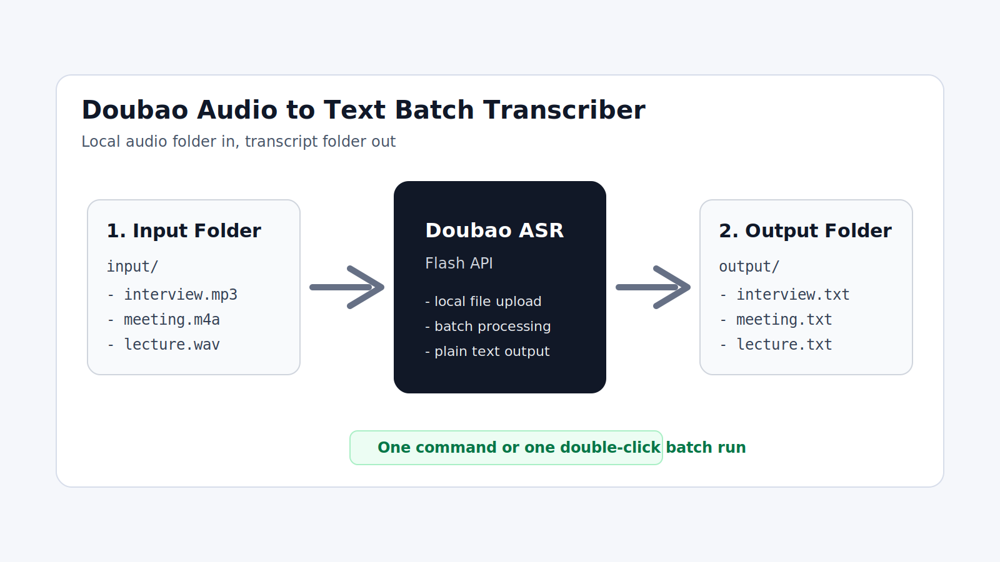

<div align="center">
  
</div>

<div align="center">

# Doubao Audio to Text Batch Transcriber

把本地音频文件夹，批量转成可直接使用的文字稿。

[快速开始](#快速开始) ·
[获取-api-key](#获取-api-key) ·
[使用流程](#使用流程) ·
[常见问题](#常见问题)

</div>

它解决的是一个非常具体的问题：

- 你已经有一批本地音频
- 你想直接调用豆包语音 API
- 你希望批量拿到同名 `.txt` 结果

适合的场景：

- 采访录音转文字
- 会议录音整理
- 课程录音转写
- 播客内容转稿
- 语音备忘录归档

## 核心特点

- 批量处理本地音频文件
- 基于豆包语音识别 `极速版` API
- 不需要公网音频 URL
- 自动保留子目录结构
- 支持递归扫描
- 支持失败重试
- 支持保存原始 JSON
- 支持命令行运行
- 支持 Windows 双击启动

## Demo

### 输入目录

```text
input/
|- Episode-01.mp3
|- Meeting-Notes.m4a
`- archive/
   `- Lecture.wav
```

### 输出目录

```text
output/
|- Episode-01.txt
|- Meeting-Notes.txt
|- archive/
|  `- Lecture.txt
`- transcribe_results.jsonl
```

### 运行结果示例

```powershell
PS C:\Users\you\doubao-audio-to-text-batch-transcriber> python .\doubao_batch_transcribe.py
[1/3] TRANSCRIBE C:\Users\you\doubao-audio-to-text-batch-transcriber\input\Episode-01.mp3
[1/3] DONE C:\Users\you\doubao-audio-to-text-batch-transcriber\output\Episode-01.txt
[2/3] TRANSCRIBE C:\Users\you\doubao-audio-to-text-batch-transcriber\input\Meeting-Notes.m4a
[2/3] DONE C:\Users\you\doubao-audio-to-text-batch-transcriber\output\Meeting-Notes.txt
[3/3] TRANSCRIBE C:\Users\you\doubao-audio-to-text-batch-transcriber\input\archive\Lecture.wav
[3/3] DONE C:\Users\you\doubao-audio-to-text-batch-transcriber\output\archive\Lecture.txt
Finished. success=3, skipped=0, failed=0, log=C:\Users\you\doubao-audio-to-text-batch-transcriber\output\transcribe_results.jsonl
```

## 真实截图

### 下载后目录结构

用户下载仓库后，直接把音频复制到 `input/`，结果会输出到 `output/`。


### 运行中的批量转写

双击 `run_transcribe.bat` 或执行 Python 命令后，终端会逐个显示处理状态。


### 转写完成后的结果

处理完成后，可以直接在 `output/` 中看到同名 `.txt` 结果和日志。


## 获取 API Key

如果你还没有豆包语音的 API Key，直接去这里：

- 火山引擎控制台：https://console.volcengine.com/
- 豆包语音快速开始：https://www.volcengine.com/docs/6561/2119699?lang=zh

拿到 API Key 后，填进本地 `config.json` 里的 `api_key` 字段即可。

控制台里你要找的页面大致是这样：


如果你想看接口文档，再看这里：

- 极速版文档：https://www.volcengine.com/docs/6561/1631584?lang=zh

## 快速开始

### 环境要求

- Windows / macOS / Linux
- Python 3.11+
- 可用的豆包语音 API Key

检查 Python：

```powershell
python --version
```

### 仓库下载后你会直接看到

```text
.
|- doubao_batch_transcribe.py
|- run_transcribe.bat
|- config.example.json
|- input/
`- output/
```

其中：

- 把音频复制到 `input/`
- 转写结果会输出到 `output/`

### Windows 用户最快流程

1. 下载或克隆本仓库
2. 把 `config.example.json` 复制为 `config.json`
3. 在 `config.json` 里填入你自己的 API Key
4. 把音频文件复制到 `input/`
5. 双击 `run_transcribe.bat`
6. 到 `output/` 里查看生成的 `.txt`

### 命令行方式

```powershell
python .\doubao_batch_transcribe.py
```

如果你想临时覆盖配置：

```powershell
python .\doubao_batch_transcribe.py .\input .\output --api-key "your-api-key" --recursive
```

## 使用流程

### 第一步：配置

把 `config.example.json` 复制为 `config.json`，然后填写你自己的 API Key。



### 第二步：放入音频并运行

把需要转写的音频复制到 `input/`，然后双击 `run_transcribe.bat`，或者运行 Python 命令。



### 第三步：查看输出

转写完成后，到 `output/` 里查看同名 `.txt` 文件。



### 总体流程



## 配置说明

推荐把真实 API Key 只保存在本地 `config.json` 中。

示例配置：

```json
{
  "api_key": "your_api_key",
  "input_dir": "input",
  "output_dir": "output",
  "resource_id": "volc.bigasr.auc_turbo",
  "extensions": [".mp3", ".wav", ".m4a", ".ogg", ".opus", ".mp4", ".flac", ".aac", ".wma"],
  "recursive": true,
  "overwrite": false,
  "retries": 2,
  "retry_wait": 3,
  "request_timeout": 600,
  "language": "",
  "save_json": false
}
```

主要字段说明：

- `api_key`：新版控制台认证
- `app_key` + `access_key`：旧版控制台认证
- `input_dir`：音频输入目录
- `output_dir`：转写输出目录
- `recursive`：是否递归扫描
- `overwrite`：是否覆盖已有结果
- `save_json`：是否保存原始接口返回

## 支持格式

默认支持这些扩展名：

- `.mp3`
- `.wav`
- `.m4a`
- `.ogg`
- `.opus`
- `.mp4`
- `.flac`
- `.aac`
- `.wma`

## 输出规则

- `input/demo.mp3` 会生成 `output/demo.txt`
- 子目录结构会保留
- 日志写入 `output/transcribe_results.jsonl`
- 开启 `save_json` 后，会额外生成原始 JSON

## 安全说明

- `config.json` 已加入 `.gitignore`
- 真实 API Key 只应该保存在你本地的 `config.json`
- 不要把 `input/`、`output/`、日志文件提交到公开仓库
- 如果真实 API Key 被发到聊天、截图、Issue 或公开页面，应该立即重建

## 常见问题

### `unrecognized arguments`

一般是命令行参数拼错了。

先看帮助：

```powershell
python .\doubao_batch_transcribe.py --help
```

### `Missing auth`

说明没有提供有效认证信息。检查：

- `config.json` 里是否设置了 `api_key`
- 是否传入了 `--api-key`
- 或者是否同时传入了 `--app-key` 和 `--access-key`

### `No matching audio files found`

说明输入目录为空，或者文件扩展名不在扫描列表里。

### 请求失败

优先排查：

- API Key 是否有效
- 账号是否有豆包语音权限
- 音频格式是否支持
- 文件大小是否超出当前接口限制

## Roadmap

- 增加更多真实演示素材
- 增加拖拽式桌面 GUI
- 增加进度条和任务状态
- 增加 `.srt` 等导出格式
- 为长音频增加标准版流程
- 打包成更适合普通用户使用的桌面应用

## License

当前仓库还没有添加正式 License 文件。
