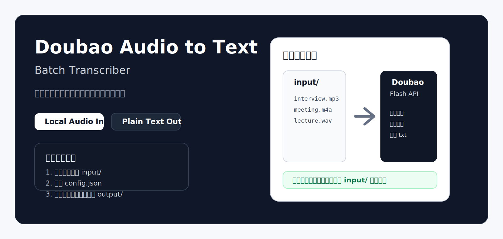
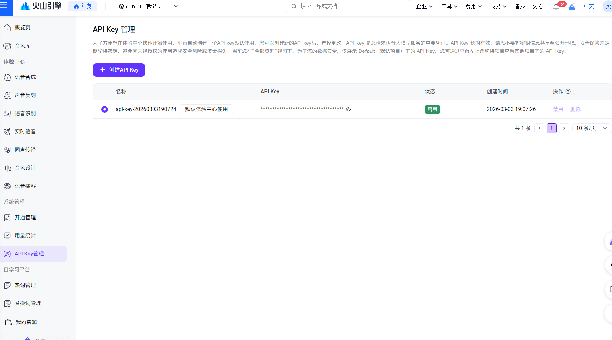
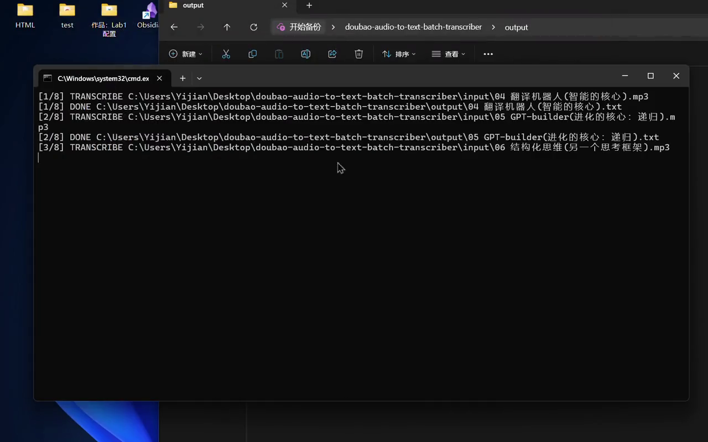
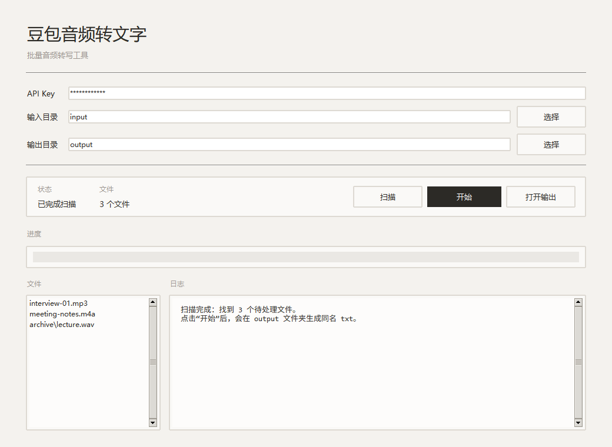
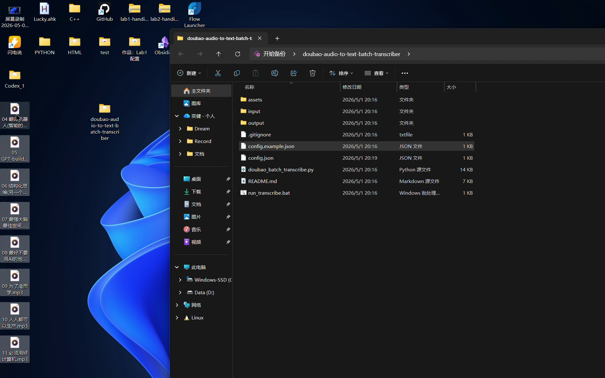
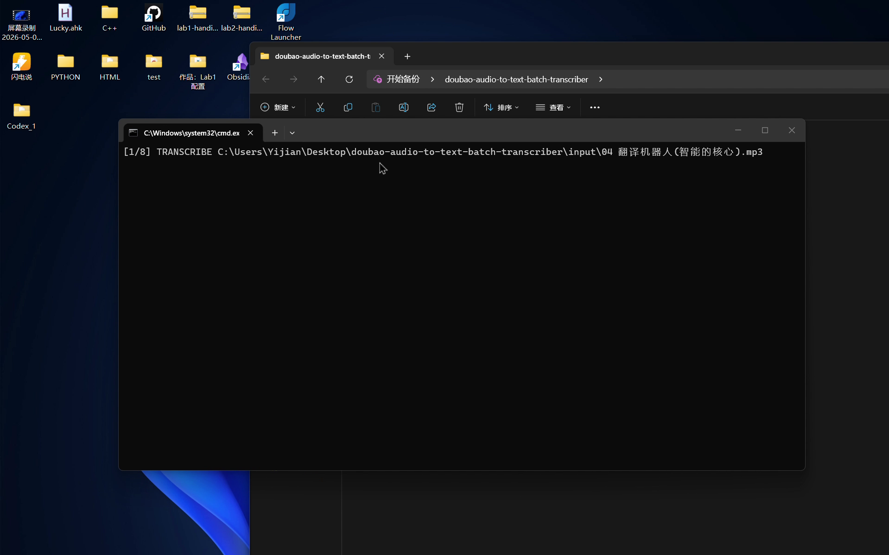
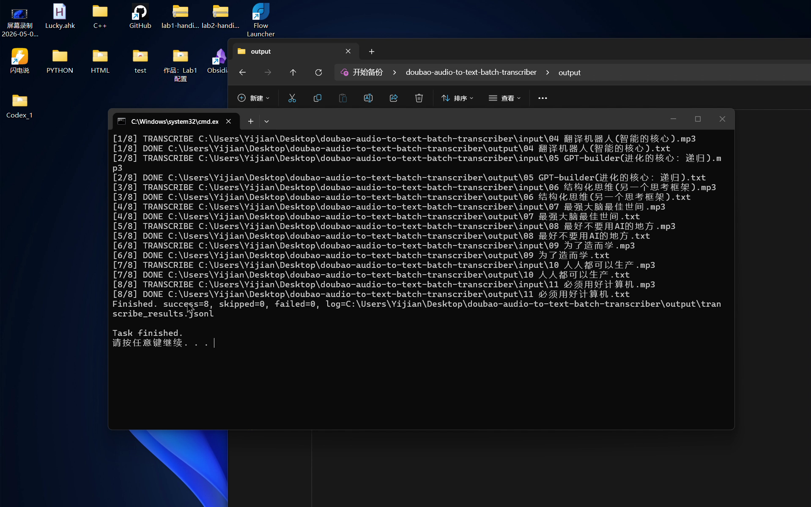

<div align="center">
  
</div>

<div align="center">

# Doubao Audio to Text Batch Transcriber

把本地音频文件夹批量转成 `.txt` 文字稿。

[快速开始](#快速开始) ·
[获取-api-key](#获取-api-key) ·
[演示视频](#演示视频) ·
[常见问题](#常见问题)

</div>

适用场景：

- 采访录音转文字
- 会议录音整理
- 播客内容转稿
- 课程录音转写
- 语音备忘录归档

## 核心特点

- 批量处理本地音频文件
- 基于豆包语音识别 `极速版` API
- 不需要公网音频 URL
- 自动保留子目录结构
- 支持递归扫描
- 支持失败重试
- 支持保存原始 JSON
- 提供极简桌面 GUI
- 支持命令行运行
- 支持 Windows 双击启动

## 快速开始

### 环境要求

- Windows / macOS / Linux
- Python 3.11+
- 可用的豆包语音 API Key

检查 Python：

```powershell
python --version
```

### 使用步骤

1. 下载或克隆本仓库
2. 把 `config.example.json` 复制为 `config.json`
3. 在 `config.json` 中填写 API Key
4. 把音频文件复制到 `input/`
5. 双击 `run_transcribe.bat`，或执行 `python .\doubao_batch_transcribe.py`
6. 到 `output/` 查看生成的 `.txt`

如果使用桌面界面：

- 双击 `run_gui.bat`
- 或执行 `python .\gui_app.py`

### 目录说明

```text
.
|- doubao_batch_transcribe.py
|- gui_app.py
|- run_gui.bat
|- run_transcribe.bat
|- config.example.json
|- input/
`- output/
```

- `input/`：放入待转写音频
- `output/`：查看转写结果

## 获取 API Key

官方入口：

- 火山引擎控制台：https://console.volcengine.com/
- 豆包语音快速开始：https://www.volcengine.com/docs/6561/2119699?lang=zh
- 极速版接口文档：https://www.volcengine.com/docs/6561/1631584?lang=zh

拿到 API Key 后，填入本地 `config.json` 的 `api_key` 字段。

控制台页面示例：



## 演示视频

- 时长约 `29 秒`
- 已裁剪为适合公开展示的短版

[](assets/demo/product-demo-short.mp4)

点击封面图可直接打开视频。

## 真实截图

### 极简 GUI



### 项目目录



### 运行过程



### 输出结果



## Demo

### 输入目录

```text
input/
|- Episode-01.mp3
|- Meeting-Notes.m4a
`- archive/
   `- Lecture.wav
```

### 输出目录

```text
output/
|- Episode-01.txt
|- Meeting-Notes.txt
|- archive/
|  `- Lecture.txt
`- transcribe_results.jsonl
```

### 运行示例

```powershell
PS C:\Users\you\doubao-audio-to-text-batch-transcriber> python .\doubao_batch_transcribe.py
[1/3] TRANSCRIBE C:\Users\you\doubao-audio-to-text-batch-transcriber\input\Episode-01.mp3
[1/3] DONE C:\Users\you\doubao-audio-to-text-batch-transcriber\output\Episode-01.txt
[2/3] TRANSCRIBE C:\Users\you\doubao-audio-to-text-batch-transcriber\input\Meeting-Notes.m4a
[2/3] DONE C:\Users\you\doubao-audio-to-text-batch-transcriber\output\Meeting-Notes.txt
[3/3] TRANSCRIBE C:\Users\you\doubao-audio-to-text-batch-transcriber\input\archive\Lecture.wav
[3/3] DONE C:\Users\you\doubao-audio-to-text-batch-transcriber\output\archive\Lecture.txt
Finished. success=3, skipped=0, failed=0, log=C:\Users\you\doubao-audio-to-text-batch-transcriber\output\transcribe_results.jsonl
```

## 配置说明

示例：

```json
{
  "api_key": "your_api_key",
  "input_dir": "input",
  "output_dir": "output",
  "resource_id": "volc.bigasr.auc_turbo",
  "extensions": [".mp3", ".wav", ".m4a", ".ogg", ".opus", ".mp4", ".flac", ".aac", ".wma"],
  "recursive": true,
  "overwrite": false,
  "retries": 2,
  "retry_wait": 3,
  "request_timeout": 600,
  "language": "",
  "save_json": false
}
```

常用字段：

- `api_key`：新版控制台认证
- `input_dir`：音频输入目录
- `output_dir`：转写输出目录
- `recursive`：是否递归扫描
- `overwrite`：是否覆盖已有结果
- `save_json`：是否保存原始接口返回

旧版认证方式也可用：

- `app_key`
- `access_key`

## 命令行用法

使用本地配置文件运行：

```powershell
python .\doubao_batch_transcribe.py
```

临时覆盖配置：

```powershell
python .\doubao_batch_transcribe.py .\input .\output --api-key "your-api-key" --recursive
```

## GUI 用法

Windows：

```powershell
.\run_gui.bat
```

或：

```powershell
python .\gui_app.py
```

GUI 支持：

- 填写 API Key
- 选择输入目录
- 选择输出目录
- 按 `扫描 -> 开始 -> 打开输出` 的顺序完成转写
- 左侧预览待处理文件
- 真实进度条
- 右侧日志面板
- 中文界面

GUI 会自动使用适合大多数人的默认设置：递归扫描子文件夹、失败自动重试、不覆盖已有结果、不额外保存 JSON。

## 支持格式

- `.mp3`
- `.wav`
- `.m4a`
- `.ogg`
- `.opus`
- `.mp4`
- `.flac`
- `.aac`
- `.wma`

## 输出内容

- 同名 `.txt` 文字稿
- `transcribe_results.jsonl` 日志
- 开启 `save_json` 后的原始接口返回

## 安全说明

- `config.json` 已加入 `.gitignore`
- 真实 API Key 只应保存在本地 `config.json`
- 不要把 `input/`、`output/`、日志文件提交到公开仓库
- 如果 API Key 已泄露，应立即重建

## 常见问题

### `unrecognized arguments`

通常是命令行参数拼写错误。

```powershell
python .\doubao_batch_transcribe.py --help
```

### `Missing auth`

说明未提供有效认证信息。请检查：

- `config.json` 中是否设置了 `api_key`
- 是否传入了 `--api-key`
- 是否同时传入了 `--app-key` 和 `--access-key`

### `No matching audio files found`

说明输入目录为空，或文件扩展名不在扫描列表中。

### 请求失败

优先检查：

- API Key 是否有效
- 账号是否有豆包语音权限
- 音频格式是否支持
- 文件大小是否超出当前接口限制

## Roadmap

- 拖拽式桌面 GUI
- 进度条和任务状态
- `.srt` 等导出格式
- 长音频标准版流程
- 免 Python 的桌面打包版本

## License

当前仓库尚未添加正式 License 文件。
